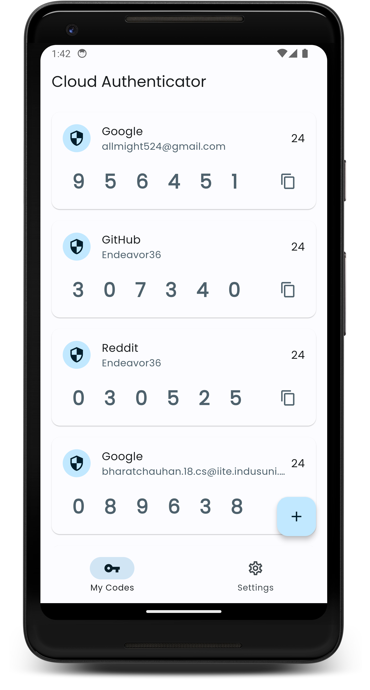
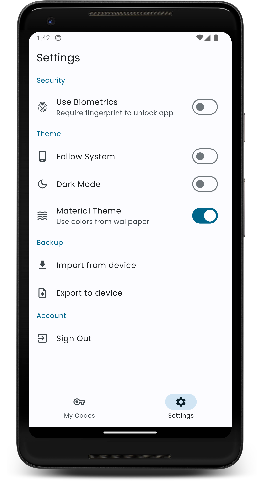

# Cloud Authenticator


This Flutter project aims to provide users with a secure and convenient way to manage their two-factor authentication (2FA) needs. The app allows users to scan QR codes to generate Time-based One-Time Password (TOTP) codes, which are securely stored on Firebase. Users can easily access their TOTP codes whenever needed. The app also shares theming options with the news app, including support for dark mode and Material You design language for a personalized experience.

## Features
- <b>QR Code Scanning</b>: Easily scan QR codes to generate and add TOTP accounts.
- <b>Secure Storage</b>: All secrets are securely stored on Firebase, ensuring they remain safe and encrypted.
- <b>TOTP Generation</b>: Generate TOTP codes on demand for secure logins.
- <b>Biometric Authentication</b>: Enable fingerprint authentication to enhance security by requiring a fingerprint scan each time the app is launched.
- <b>Import/Export Functionality</b>: Easily back up and restore your TOTP secrets by exporting them to a text file stored on your device, and importing them back when needed.
- <b>Dark Theme Support</b>: Enjoy a comfortable user experience in low-light conditions with full dark theme support.
- <b>Material You Support</b>: Experience Android 12’s dynamic theming with Material You, allowing personalized color schemes based on your device settings.
- <b>Cross-Platform Sync</b>: Seamlessly sync your TOTP accounts across devices using Firebase.
- <b>User-Friendly Interface</b>: Intuitive design and easy navigation make managing 2FA codes effortless.

## Screenshots

<div style="display: flex; justify-content: center; align-items: center;">
  

  
</div>

## Getting Started

### Prerequisites

- Flutter SDK: [Installation Guide](https://flutter.dev/docs/get-started/install)

### Installation

1. Clone the repository:

    ```shell
    git clone https://github.com/chauhan2b/cloud_authenticator.git

2. Navigate to the project directory:

    ```shell
    cd cloud_authenticator

3. Install the dependencies:

    ```shell
    flutter pub get

4. Generate the providers using riverpod generator

    ```shell
    dart run build_runner build -d

## Usage
Upon launching the Cloud Authenticator app, you will be presented with your list of TOTP codes, securely stored and ready for use. You can easily add new accounts, manage existing ones, and customize the app's settings to suit your preferences.

### Adding Secrets
To add a new account and start generating TOTP codes, follow these steps:
1. Add the '+' icon at the bottom of the home screen.
2. Choose from manually adding a string or scanning a QR code.
3. After entering a string or scanning a QR code, your account will be added automatically and you'll see the codes on the home screen.

## Material You Support
This app embraces the Material You design language introduced in Android 12. It allows the app's appearance to be customized based on system-wide themes and color schemes, providing a more personalized user experience.

## Contributing
Contributions are welcome. If you find any bugs, have suggestions for new features, or would like to improve the code, please feel free to open an issue or submit a pull request.